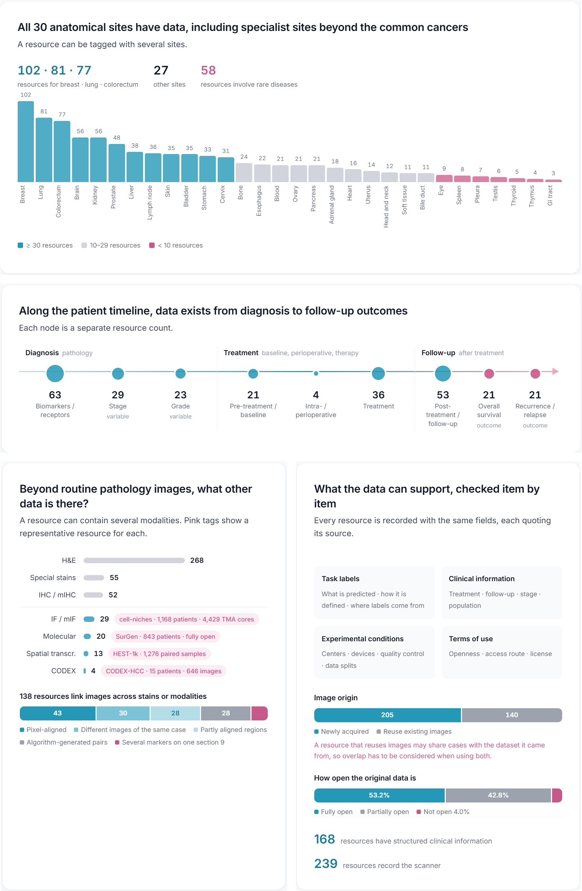

<p align="center">
  <a href="https://www.pathtrove.cn">
    <picture>
      <source media="(prefers-color-scheme: dark)" srcset="assets/readme/logo-dark.svg">
      
    </picture>
  </a>
</p>

<h3 align="center">Toward Ready-to-Use Clinical Data Services for Computational Pathology</h3>

<p align="center">
  PathTrove organizes pathology data resources, research papers and experiment-ready labels for AI and pathology researchers.
  It helps you find suitable data, check study conditions, and avoid repeating the work of downloading and organizing data.
</p>

<p align="center">
  <a href="https://www.pathtrove.cn"></a>
  <a href="https://aicarrier.feishu.cn/base/Ab7tb1c4VaxYIesGpnCchZkKn98?table=tblg0z31jVeg7WIh&view=vewLEEtCvC"></a>
  <a href="https://www.pathtrove.cn/ask.html"></a>
  <a href="https://www.pathtrove.cn/atlas.html"></a>
</p>

<p align="center"><b>English</b> · <a href="./README.zh-CN.md">中文</a></p>

## What PathTrove provides

<p align="center">
  
</p>

Search and feasibility studies are built on one evidence database: resource reports, data-source reports, paper reports, download guides and label files.

## What the database covers

Every entry is checked against its sources, from what was studied and what was measured to labels and clinical information.

<p align="center">
  
</p>

<p align="center"><a href="https://www.pathtrove.cn/atlas.html">Explore the full data atlas →</a></p>

## Reports, guides and labels

Five kinds of material take you from understanding a dataset to preparing an experiment.

> **Access Note**: The complete resource table and detailed reports currently require a simple access request via the [Feishu table](https://aicarrier.feishu.cn/base/Ab7tb1c4VaxYIesGpnCchZkKn98?table=tblg0z31jVeg7WIh&view=vewLEEtCvC). They will be made fully and openly accessible once our technical report is officially released.

| Material | What it records | Example |
| --- | --- | --- |
| **Resource report** · 355 | Content, labels, clinical information and the source behind each of 38 fields | [CRC-MSI (TCGA-CRC-DX)](./examples/TCGA-CRC-DX_report.en.md) |
| **Data-source report** · 11 sources | How an upstream platform such as TCGA, CPTAC, HTAN or GTEx organizes projects, cases and files, and how to get access | [TCGA](./examples/TCGA_source_report.en.md) |
| **Paper report** · 106 studies | How a study used its data, task by task: inputs and outputs, data roles, splits and evidence | [NePSTA (*Nature Cancer*, 2025)](./examples/NePSTA_paper_report.en.md) |
| **Download guide** · 355 | Official files, access conditions and download steps | [Ovarian-Bevacizumab-Response (TCIA)](./examples/Ovarian-Bev_download_guide.en.md) |
| **Label file** · 105 resources | Samples matched to task labels and experiment splits | [Ovarian bevacizumab response (JSON)](./examples/Ovarian-Bev_label.json) |

> Representative examples for each material type are provided in the GitHub [`examples/`](./examples/) directory to demonstrate schema design, task framing, and provenance structure. **Please note that these are draft demonstrations rather than the final complete release**; the full, systematically verified catalog will be released alongside our forthcoming technical report and updated continuously. When primary sources disagree, PathTrove faithfully preserves both accounts and quotes the underlying evidence.

## From a research need to experiment-ready data

Turning a clinical research question into benchmarked, model-ready data is rarely straightforward. Researchers often face ill-defined evaluation setups, multi-condition filtering across scattered metadata, unverified source contradictions, and high-friction data access.

PathTrove bridges the gap from research needs to experiment-ready data through a systematic, database-backed workflow:

1. **Task Deconstruction & Feasibility Check** (*Paper reports*)  
   Starting from an overarching clinical question (such as treatment response prediction, molecular subtyping, or survival risk modeling), peer-reviewed paper reports reveal how prior studies framed tasks, defined inputs/outputs, and benchmarked models. This grounds the research setup in proven precedents and clarifies whether public data can realistically support the evaluation before investing engineering effort.
2. **Multi-condition Screening & Cohort Matching** (*Database & Resource reports*)  
   Using structured filters across 38+ metadata fields—spanning 30 anatomical sites, staining modalities, scanner specifications, and clinical variables (such as stage, grade, therapy regimens, and follow-up endpoints)—researchers pinpoint suitable candidate resources. The database clarifies cohort sizes and data roles to design sound internal training/validation sets alongside independent external validation cohorts.
3. **Source-backed Evidence & Quality Audit** (*Evidence statements*)  
   Public datasets frequently suffer from conflicting counts, vague label definitions, or mismatched sample identifiers. Every critical field in PathTrove is linked directly to verbatim source citations from papers, data portals, and release manifests. By preserving conflicting claims rather than smoothing them over, the database allows researchers to spot data traps and ambiguities before data processing begins.
4. **Acquisition & Ready-to-Use Label Integration** (*Download guides & Label files*)  
   Download guides provide verified acquisition paths from official repositories, detailing access permissions and tested network routing. Corresponding standardized label files then deliver sample-level targets, task definitions, and leak-free patient splits in clean, machine-readable JSON, allowing researchers to plug data directly into training pipelines.

## Using PathTrove responsibly

1. Use the table and reports to find resources that may fit your study.
2. Check decision-critical claims against the cited primary sources.
3. Confirm the current license, terms, access procedure and data version with the original provider.

PathTrove does not host or redistribute pathology data. It does not endorse the listed resources, and their providers do not endorse PathTrove. Listing a resource grants no access or reuse rights, and PathTrove is not medical advice. See the [Research Use Terms](./TERMS_OF_USE.md) for details.

## Citation

If you find PathTrove useful for your research, please consider starring our repository ⭐ and citing our work:

PathTrove does not have a formal peer-reviewed publication yet. Until the paper is published, please cite the project as follows, and include the access date (the database and reports are updated continuously):

```text
PathTrove Contributors. PathTrove: Toward Ready-to-Use Clinical Data Services for Computational Pathology. https://github.com/DearCaat/PathTrove. Accessed YYYY-MM-DD.
```

```bibtex
@misc{pathtrove2026,
  title        = {PathTrove: Toward Ready-to-Use Clinical Data Services for Computational Pathology},
  author       = {Wenhao Tang and Yu Li and Yubin Zhang and Xiangyu Ran and Yiyang Su and Jin Li and Xiang Li and Fang Yan and Ming-Ming Cheng and Yirong Chen},
  year         = {2026},
  howpublished = {\url{https://www.pathtrove.cn}},
  note         = {Accessed: YYYY-MM-DD}
}
```

Machine-readable metadata are in [`CITATION.cff`](./CITATION.cff).

## Corrections

Please report errors through [GitHub Issues](https://github.com/DearCaat/PathTrove/issues). Include the resource name, the affected field, the current and proposed values, and a primary source URL with its access date. Submissions are checked against the evidence before they are incorporated.

## License

- Documentation and website material authored for this repository: [CC BY 4.0](./LICENSE).
- The PathTrove table, reports, label files and other curated resources: [PathTrove Research Use Terms](./TERMS_OF_USE.md). Non-commercial research use is permitted; commercial use, and redistributing all or a substantial part, need prior permission.
- Third-party datasets, papers, names and logos remain under their own rights and terms.

<p align="center"><sub>Maintained by Nankai University and Shanghai AI Laboratory · © 2026 PathTrove Team</sub></p>
