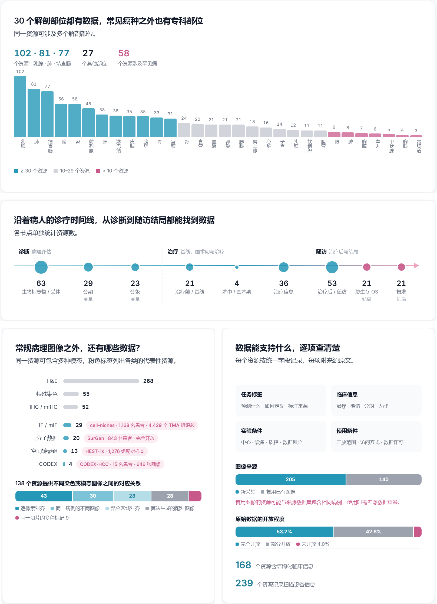

<p align="center">
  <a href="https://www.pathtrove.cn">
    <picture>
      <source media="(prefers-color-scheme: dark)" srcset="assets/readme/logo-dark.svg">
      
    </picture>
  </a>
</p>

<h3 align="center">从临床研究需求，到开箱即用的病理数据</h3>

<p align="center">
  PathTrove 为 AI 与病理研究者整理数据资源、研究论文和实验所需的标签。帮助你找到合适的数据、核对研究条件，减少下载与整理数据的重复工作。
</p>

<p align="center">
  <a href="https://www.pathtrove.cn"></a>
  <a href="https://aicarrier.feishu.cn/base/SNtNbp0wTaML2xsH9CMclNrrnth?table=tblknwImsVXlTfJA&view=vewLEEtCvC"></a>
  <a href="https://www.pathtrove.cn/ask.html"></a>
  <a href="https://www.pathtrove.cn/atlas.html"></a>
</p>

<p align="center"><a href="./README.md">English</a> · <b>中文</b></p>

## PathTrove 提供什么

<p align="center">
  
</p>

检索与可行性研究都建立在同一套循证数据库上：资源报告、数据源报告、论文报告、下载指南和标签文件。

## 数据库覆盖

从研究对象、数据模态到标签与临床信息，逐项核对来源。

<p align="center">
  
</p>

<p align="center"><a href="https://www.pathtrove.cn/atlas.html">查看完整数据版图 →</a></p>

## 报告、指南与标签

五类材料，从读懂数据，到准备实验。

> **访问说明**：目前完整的资源表格与详细报告需通过[飞书表格](https://aicarrier.feishu.cn/base/SNtNbp0wTaML2xsH9CMclNrrnth?table=tblknwImsVXlTfJA&view=vewLEEtCvC)进行简单申请以获取访问权限；待后续技术报告正式发布（Release）后，将全面无门槛开放。

| 材料 | 记录什么 | 示例 |
| --- | --- | --- |
| **资源报告** · 355 份 | 内容、标签、临床信息与来源依据，共 38 个字段，每个字段附来源原文 | [CRC-MSI（TCGA-CRC-DX）](./examples/TCGA-CRC-DX_report.md) |
| **数据源报告** · 11 个数据源 | TCGA、CPTAC、HTAN、GTEx 等上游平台的项目组成、病例与文件关系，以及获取条件 | [TCGA](./examples/TCGA_source_report.md) |
| **论文报告** · 106 篇论文 | 按任务还原论文的数据用法：输入输出、数据角色、划分方式与证据来源 | [NePSTA（*Nature Cancer*，2025）](./examples/NePSTA_paper_report.md) |
| **下载指南** · 355 份 | 官方文件、访问条件与下载步骤 | [Ovarian-Bevacizumab-Response（TCIA）](./examples/Ovarian-Bev_download_guide.md) |
| **标签文件** · 105 个资源 | 对应样本、任务标签与实验划分 | [卵巢癌贝伐珠单抗疗效（JSON）](./examples/Ovarian-Bev_label.json) |

> 各类材料的代表性样例已收录在 GitHub [`examples/`](./examples/) 目录中，主要用于展示规范、数据架构与任务组织形式，**并非最终完整版本**；全量、经过进一步扩充的正式材料与更广泛的标签划分，将在后续技术报告 Release 时全面开放并持续维护。当一手来源之间存在口径冲突时，PathTrove 如实保留双方口径并注明依据。

## 从研究需求到实验数据

把一个临床或病理科研设想推进到可在 GPU 上运行的实验数据，往往面临多重阻碍：宏观的研究构想难以快速拆解为严谨的机器学习任务、多维严苛的研究条件在海量碎片化数据中极难匹配、公开数据的元数据与标签常存口径冲突，而下载受阻与繁琐的数据清洗更耗费大量精力。

PathTrove 通过一套系统的循证数据库与配套材料，打通从“研究需求”到“实验就绪数据”的全流程支撑：

1. **任务拆解与可行性论证**（依托论文报告）  
   从宏观的临床问题（如特定药物敏感性预测、分子亚型分型或生存预后评估）出发，结合收录的同行论文报告，梳理既往研究的数据用法、任务定义、输入输出规格与基准表现。借此将研究设想落到切实可评价的任务上，并在动手前判断公开数据是否足以支撑、是否存在关键队列缺口。
2. **多维条件检索与队列规划**（依托数据库与资源报告）  
   围绕研究设想在器官部位、疾病亚型、染色模态、扫描仪设备以及临床变量（如分期、分级、用药、随访结局）上的多重约束，在 355 个资源与 30 个解剖部位中精准初筛；核对各个资源的样本规模与入组边界，合理规划内部训练集、内部验证集与独立外部验证队列。
3. **一手证据核查与口径对齐**（依托字段级来源语句）  
   公开数据集常存在切片与患者混淆、标签定义模糊或不同来源记载矛盾。PathTrove 为关键字段保留论文原文、官方页面或元数据清单的一手引述；当来源之间存在矛盾时如实保留双方口径并说明理由，帮助研究者在进入实验前排查潜在陷阱，避免因口径错误导致研究返工。
4. **合规实测获取与标签开箱即用**（依托下载指南与标签文件）  
   依据经过中国大陆网络实测的下载指南，从官方渠道合规、高效地获取原始图像与元数据；直接使用由确定性脚本整理的标准任务级标签文件，样本标识、任务标签与严防数据泄漏的患者级实验划分（Train / Val / Test）一一对应，程序可直接读取加载，直接进入模型训练与评估。

## 负责任地使用

1. 用表格和报告找出可能适合研究的资源。
2. 对影响研究决策的内容，回到所引用的一手来源核验。
3. 向原始提供方确认当前的许可证、使用条款、访问流程和数据版本。

PathTrove 不托管、不分发病理数据；不为所收录资源背书，这些资源的提供方也不为 PathTrove 背书。收录某项资源不代表因此获得访问或复用权，PathTrove 也不构成医疗建议。详见 [PathTrove 科研使用条款](./TERMS_OF_USE.md)。

## 引用

如果觉得 PathTrove 对你的研究有帮助，十分欢迎引用我们的工作，也欢迎在 GitHub 上给我们点一个 ⭐️ Star！

PathTrove 尚无正式发表的期刊/会议论文。在正式论文发表前，请按以下格式引用本项目，并注明访问日期（表格和报告会持续更新）：

```text
PathTrove Contributors. PathTrove: Toward Ready-to-Use Clinical Data Services for Computational Pathology. https://github.com/DearCaat/PathTrove. Accessed YYYY-MM-DD.
```

```bibtex
@misc{pathtrove2026,
  title        = {PathTrove: Toward Ready-to-Use Clinical Data Services for Computational Pathology},
  author       = {Wenhao Tang and Yu Li and Yubin Zhang and Xiangyu Ran and Yiyang Su and Jin Li and Xiang Li and Fang Yan and Ming-Ming Cheng and Yirong Chen},
  year         = {2026},
  howpublished = {\url{https://www.pathtrove.cn}},
  note         = {Accessed: YYYY-MM-DD}
}
```

机器可读的引用信息见 [`CITATION.cff`](./CITATION.cff)。

## 报告错误

欢迎通过 [GitHub Issues](https://github.com/DearCaat/PathTrove/issues) 提交修正，请写明资源名称、涉及字段、当前与建议的内容，以及一手来源链接和访问日期。提交内容会依据证据核查后再决定是否纳入。

## 许可

- 本仓库原创的项目文档和网站材料：[CC BY 4.0](./LICENSE)。
- PathTrove 表格、报告、标签文件及其他整理资源：[PathTrove 科研使用条款](./TERMS_OF_USE.md)。允许非商业科研使用；商业使用以及对全部或实质部分的二次分发，须事先取得许可。
- 第三方数据集、论文、名称和 Logo 仍受各自权利和条款约束。

<p align="center"><sub>维护机构：南开大学与上海人工智能实验室 · © 2026 PathTrove Team</sub></p>
